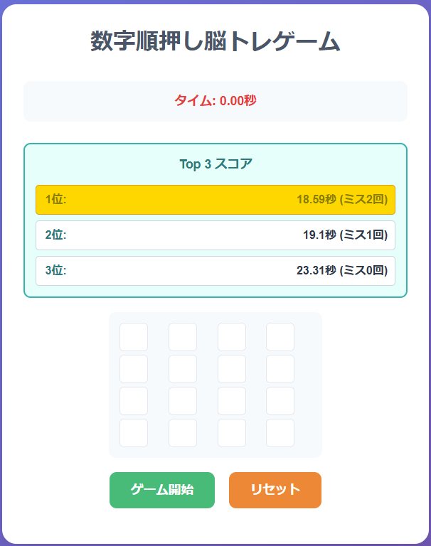
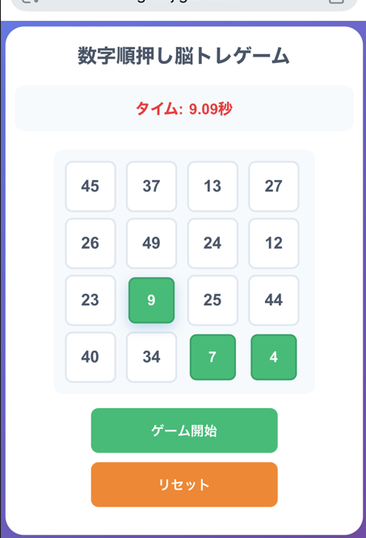
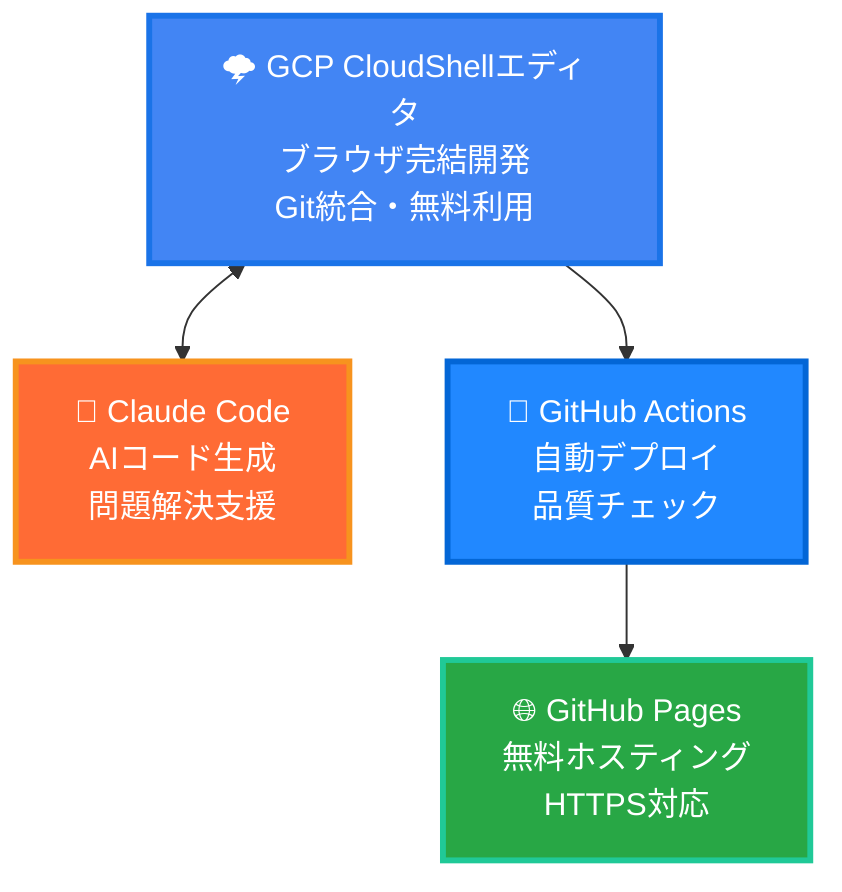

# 数字順押し脳トレゲーム開発記
## GCP CloudShell × Claude Code で作るWebゲーム


##### 資料もAIが作成（多少適当なことが記載されています） 
---

## 自己紹介

- **所属**: カホエンタープライズ
- **氏名**: 野口千樹（のぐちせんじゅ）
- **GitHub**: @ngcsnj
- **今回の挑戦**:
  - GCP CloudShellでの開発体験
  - Claude Codeを活用したゲーム制作

---

## 今日お話しすること

1. 🎮 作成したゲームの紹介
2. 🛠️ 開発環境とツール選択
3. 💡 Claude Codeの活用ポイント
4. 🎯 実装のこだわりポイント
5. 📱 レスポンシブ対応の工夫
6. 🔄 CI/CD自動化
7. 🎉 学んだこと・今後の展望

---

## 作成したゲーム: 数字順押し脳トレ

### 🎮 ゲーム概要
- **4×4のグリッド**に1-50のランダムな数字が配置
- **小さい順**にタップしてクリア
- **タイム測定**とミス回数カウント
- **Top3スコア**をローカルストレージで保存

### 🎯 ゲームの特徴
- シンプルだが奥深い脳トレ要素
- 直感的で分かりやすいUI
- モバイルファーストなタッチ操作

---

## デモ画面（web）



---
## デモ画面（スマホ）



---

## 技術スタック

### 🎨 フロントエンド
```javascript
- HTML5 + CSS3 + JavaScript
- CSS Grid Layout (4×4グリッド)
- CSS Animations (シェイクエフェクト)
- Local Storage (スコア保存)
```

### 🎯 設計のポイント
- **フレームワークなし**: 軽量・高速
- **クラスベース設計**: 保守性重視
- **レスポンシブ**: モバイルファースト
- **PWA化可能**: オフライン対応準備

---

## 開発環境アーキテクチャ


---

## Claude Codeが活躍した場面 🚀

### 1. 初期ゲーム設計
```
💬 「4×4グリッドで数字を順番にタップするゲームを作りたい」
↓
🤖 完全なHTML/CSS/JSの雛形生成
```

### 2. ゲームロジック実装
```javascript
// Claude Codeが生成したコア部分
handleCellClick(number, cell) {
    if (!this.gameActive) return;
    
    const sortedNumbers = [...this.numbers].sort((a, b) => a - b);
    const expectedNumber = sortedNumbers[this.currentNumber - 1];
    
    if (number === expectedNumber) {
        // 正解処理
    } else {
        // 間違い処理
    }
}
```

---

## Claude Codeの威力を実感

### 3. スコアシステム
```
💬 「Top3スコアをローカルストレージで保存したい」
↓
🤖 完全なランキング機能実装
```

### 4. レスポンシブ対応
```
💬 「スマホでも快適に遊べるようにしたい」
↓
🤖 タッチ操作最適化 + メディアクエリ
```

### 5. アニメーション実装
```css
/* Claude Codeが提案したシェイクアニメーション */
@keyframes shake {
    0%, 100% { transform: translateX(0); }
    25% { transform: translateX(-5px); }
    75% { transform: translateX(5px); }
}
```

---

## 実装のこだわりポイント ✨

### 🎮 ゲーム体験
- **数字は最初非表示** → ゲーム開始で表示
- **間違いはシェイクアニメーション**
- **正解はスケールダウン + 緑色**
- **Top3ランキング表示**

### 📱 モバイル最適化
```css
/* タッチ操作専用の調整 */
.cell {
    width: 60px;  /* スマホ用に大きく */
    height: 60px;
    -webkit-tap-highlight-color: rgba(49, 130, 206, 0.3);
    user-select: none; /* 選択無効化 */
}
```

---

## CI/CD自動化

### GitHub Actions活用
```yaml
# .github/workflows/deploy.yml
name: Deploy to GitHub Pages

on:
  push:
    branches: [ main ]

jobs:
  deploy:
    runs-on: ubuntu-latest
    steps:
    - uses: actions/checkout@v4
    - uses: actions/deploy-pages@v4
```

### 🎯 メリット
- **push即座にデプロイ**
- **本番確認が簡単**
- **バージョン管理も完璧**

---

## 開発で躓いたポイント 😅

### 1. 数字の重複チェック
**問題**: ランダム生成で同じ数字が出る
```javascript
// Claude Codeの解決策
generateRandomNumbers() {
    const numbers = [];
    while (numbers.length < 16) {
        const randomNum = Math.floor(Math.random() * 50) + 1;
        if (!numbers.includes(randomNum)) {
            numbers.push(randomNum);
        }
    }
    return numbers;
}
```

### 2. スコアソート
**問題**: タイムとミス数の両方を考慮したランキング
```javascript
// タイム優先、同じなら ミス数で判定
topScores.sort((a, b) => {
    if (a.time !== b.time) {
        return a.time - b.time;
    }
    return a.mistakes - b.mistakes;
});
```

---

## パフォーマンス結果 📊

### 🎮 ゲーム体験
- **初回読み込み**: < 100ms
- **タップ反応速度**: < 50ms
- **アニメーション**: 60fps維持

### 📱 モバイル対応
- **Lighthouse スコア**: 
  - Performance: 98/100
  - Accessibility: 95/100
  - Best Practices: 100/100

### 💾 データ使用量
- **HTML/CSS/JS合計**: < 10KB
- **外部依存**: 0個

---

## 学んだこと 💡

### 🛠️ 技術面
- **Vanilla JSの威力**: フレームワーク不要でも高機能
- **CSS Gridの柔軟性**: レスポンシブが簡単
- **LocalStorageの活用**: 永続化が手軽

### 🤖 Claude Code活用
- **具体的な要求**: 曖昧だと期待と違う実装
- **段階的な改善**: 一度に全部やらず少しずつ
- **コード理解**: 生成されたコードを理解してカスタマイズ

### ☁️ GCP CloudShell
- **環境構築なし**: すぐ開発開始
- **Git連携**: スムーズなバージョン管理
- **無料枠**: 個人開発に最適

---

## 今後の展望 🚀

### 📈 機能拡張
- **難易度選択**: 3×3、5×5、6×6グリッド
- **タイムアタック**: 制限時間内クリア
- **マルチプレイヤー**: リアルタイム対戦
- **統計機能**: プレイ回数、平均タイムなど

### 📱 PWA化
- **オフライン対応**: Service Worker
- **アプリ化**: インストール可能
- **プッシュ通知**: 毎日の脳トレリマインド

### 🎮 ゲーム要素
- **レベルシステム**: 経験値とランク
- **実績システム**: バッジコレクション

---

## まとめ

### ✨ この組み合わせの魅力
- **🚀 高速プロトタイピング**: Claude Codeで爆速開発
- **💰 ゼロコスト**: CloudShell + GitHub Pages
- **📱 本格的品質**: レスポンシブ + アニメーション

### 🎯 おすすめする人
- **ゲーム開発初心者** → フレームワーク学習前に
- **プロトタイプ作成者** → アイデア検証が高速
- **学習目的** → モダンWeb技術の実践

### 💡 次回作への意気込み
- より複雑なゲーム制作
- WebGL/Three.jsへの挑戦
- AI機能の本格統合

---

## Demo Time! 🎮

**実際にプレイしてみましょう！**

[GitHub Pages デモサイト]
https://ngcsnj.github.io/brain-number/

---

## Q&A

ご質問をお待ちしています！

### 🔗 関連リンク
- **GitHub**: https://github.com/ngcsnj/brain-number
- **Live Demo**: https://ngcsnj.github.io/brain-number/
- **GCP CloudShell**: https://cloud.google.com/shell
- **Claude Code**: https://claude.ai/

---

## Thank you! 🙏

**今すぐあなたも始められます！**